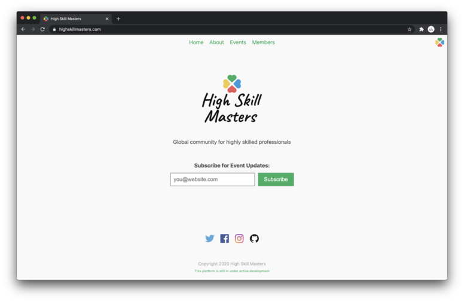

# High Skill Masters Web

High Skill Masters web application that has:

- Homepage
- About
- Events
- Members

Other upcoming features:

- Forum
- Job Board

For getting started as a developer, read the [CONTRIBUTING](./CONTRIBUTING.md) file.

## Tech Stack

### Tools

- VS Code
- Figma
- JavaScript
- Node.js

### Libraries

- React
  - React Router DOM
  - React Helmet
  - React Hook Form
  - React Google Analytics
- Redux
  - Redux Dev Tools
  - Redux Thunk
- axios/redaxios
- emotion
- Jest
- ESLint
- Prettier

### Infrastructure

- Uniregistry
- Cloudflare
- Netlify
- Google Cloud Platform
  - Google Compute Engine
  - Google App Engine

## License

[MIT Licnse](./LICENSE)
